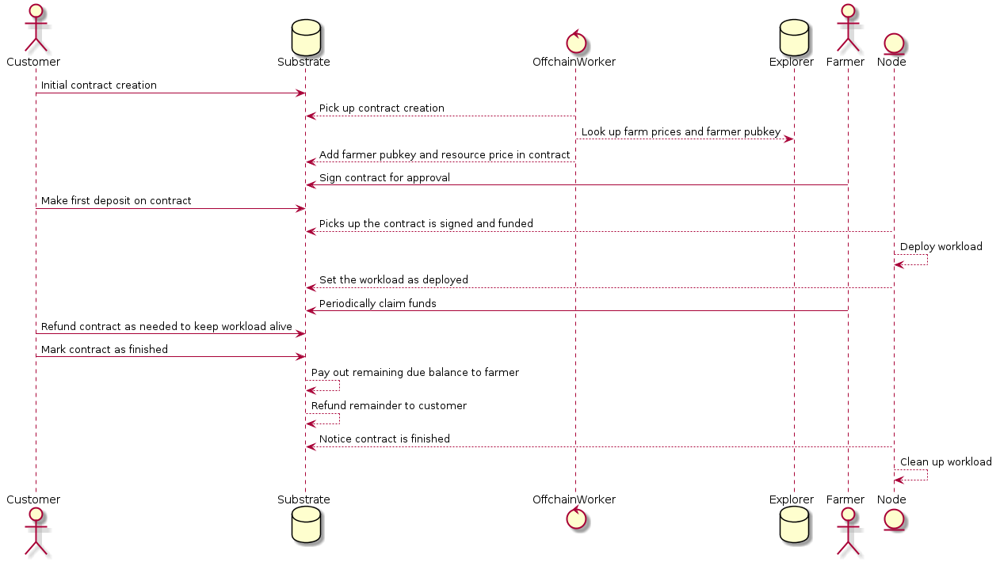

# Smart contract 4 IT.

## Overview

The current smart contract 4 IT on the Threefold Grid is centralized. It is owned by the *explorer* and all it's data sits in a MongoDB. We want to decentralize the way a User and a Farmer aggree on what needs to be deployed on their nodes.

## Current architecture

The TFexplorer is responsible for deploying, decomissioning, refunding, .. of workloads. It is the intermediate party between the User and the Farmer on the Threefold Grid. For more details on the workings of the current model: https://manual2.threefold.io/#/smartcontract_details

The issue with this architecture is that there is a single point of failure. In this case it can be the machines where the explorers are running on.

We, as a company, also promote decentralization in any way possible. The very way we run this critical component centralized is contradictionary.

## Proposed architecture

We need to change how the intermediate party is handled in order to achieve true decentralization. This component needs to act as a trusted party which nobody has control over, not even us. The best way to achieve this is with some sort of blockchain technology. A blockchain where we can have the smart contract 4 IT on it. If it's on the blockchain, everybody can verify that it exists and that it cannot be tampered with. Eventually this party handles money, which is very sensitive.

The blockchain can be used to track the following information which is crucial in the deployment of workloads:

- Make an aggreement between a farmer and a user for a workload.
- Manage funds of this aggreement.
- Manage the state of a workload.
- ..

We currently use Stellar blockchain for our Token economy. Stellar does not support smart contracts in a way that we would need them to decentralize the explorer.

## Proposed technology

As we need a blockchain to be this intermediate party to achieve decentralization, we will be looking at [Substrate](https://www.parity.io/substrate/). This is a new blockchain technology which is written in Rust and is modular by design. This means we can plug in additional features which fits our needs. This can be done either by:

- Runtime pallets
- Smart contracts
- Offchain workers

These features will enable us to create a blockchain that has a sole purpose of decentralizing the User <-> Farmer relationship on the Threefold grid.

If we run a Substrate node that has the smart contract 4 IT capability, then any farmer / user can connect to this node and start using it. If they want to extend trust to this blockchain they can run a node themself, and connect to that one. If more and more farmers also run a node, then we create a decentralized network of trust for the smart contract 4 IT to live on.

We could for example run a substrate node inside ZOS on any farmer node.

## Caveats

Currently we have chosen to implement our Token economy on the Stellar blockchain. To make this compatible with the Substrate chain we need to bridge payments. This means we need some service that for example, when a user pays for a workload in Stellar TFT, we bridge this payment and fund the contract on chain with Substrate TFT.

## Proof of concept

In the first phase we would make a proof of concept that handles the following parts:

- Create an aggreement to deploy a Volume reservation on a specific node.
- Handle funds of this aggreement (Payments will not include Stellar TFT).
- Deploy Volume reservation on a ZOS node.
- Cancel reservation
- Payment to farmer
- ..

We will use a Substrate node template and add a runtime pallet to it.
This runtime pallet will expose functions that will be callable by the User / Farmer.

In the pallet we will have runtime storage. Runtime storage allows you to store
data in your blockchain that is persisted between blocks and can be accessed from
within your runtime logic. In this storage we will save the information needed to
create a contract between a User and a Farmer.

When the user wants to create a reservation we will ask for a nodeID and the volume
definition. With this nodeID we want to fetch the farmer's information of the *explorer*.
We can do that with an off-chain worker. An off-chain worker will execute some
specific logic before a block gets imported into the chain.
With this worker we can fetch the farmer's prices to deploy workloads on his farm
and store this in the runtime storage. Methods called by the worker will have
verification so that only a specif key, or a specific set of keys, can sign them.
As a result, only trusted workers can actually perform this functionality. While
this is not ideal since it maintains the centralized explorer, that could be solved
in a real world setup by moving the (static) data on chain as well. This could
be done, for example, by integrating DID's. In such a scenario, farmer and node
definition would be done on chain as well through DID's, meaning this part becomes
fully decentralized.

The main reason to fetch the farmer data is so that we can set the price of the
resources consumed in the contract, as well as set the public key of the farmer.
This then allows us to verify that it is actually the farmer, and nobody else,
who accepts the contract. To accomplish this, we can derive the SS58 address
(the substrate address format) from the public key we fetched (ed25519 keys are
supported in substrate). We also don't need to save any kind of signature in the
runtime storage, a simple bool would suffice. Reason being that the code can only
be called successfully by the given key, and the extrinsic (the transaction which
called the method) which contains a signature from this keypair is recorded in
the block and therefore verifiable by everyone.

When we have the farmer's prices and the volume definition we can ask the user
to pay a certain amount to deploy the workload. When a user pay's we will store
the token amount on chain and release payments to the farmer gradually based on
the usage of the volume. In an ideal situation, these payments would be automated
from within the chain. This would however place a lot of stress on the runtime,
since it needs to verify, at every block, if there are contracts to pay out, and
if so do that. So instead, we will opt to do some tracking of when the workload
was deployed, and when the farmer withdrew funds for the last time. Then, when
a farmer makes a new withdraw request, we can easily calculate how much tokens
he should receive from the contract using a linear function. If the farmer wishes
to have some kind of periodic payment, then he can simply set this up via the farmer
threebot, which can call a periodic function for all interesting contracts.

After a workload is paid for by the user we will fetch this information directly
on the ZOS node and verify that it is indeed a workload for it to deploy. We will
listen on changes on the blockchain to deploy / cancel the volume accordingly.

When a workload is deployed (successfully or failed), the node should send this
back to the chain. Ideally, the node itself would make a call with the result.
This can be verified, since the node can use its same keypair that it's already
using right now, to sign the call. Then the blockchain can verify that the address
which made the call is indeed the same as the one in the contract, similar to how
we can secure the farmer agreement flow. This does mean that every node needs a
small amount of funds to pay tx fees. If this is found to be not feasible, we can
alternatively integrate the farmer threebot in the deployment flow, so the farmer
ultimately pushes the result back. Again, verification of the sending address can
then be done against the farmer key like before, to make sure its the real farmer
that pushes a result.

Ideally, the contract itself would know when it is out of funds. This might be hard
to actually accomplish though, since it requires running logic for every contract
in every block. Therd might be a solution by adding every contract ID in a separate
collection, and running code after every block which checks if the contract has
expired. This solution hinges on the ability to generate events in post-block import
logic, rather than in actual extrinsics in a block itself. This is something we
need to investigate. The other solution would be to have the farmer threebot monitor
relevant contracts, and having them call a cancel function once the funds run out.

If a user wishes to cancel his workload, we can calculate how much the farmer is
owed (by checking when he last withdrew funds). Then the remaining contract balance
can be split and paid out accordingly, where the user receives all remaining funds
after the farmer received what he was still owed. This would mean that a user can
cancel his workload at any time and receive his unused tokens back.

sequence diagram:

